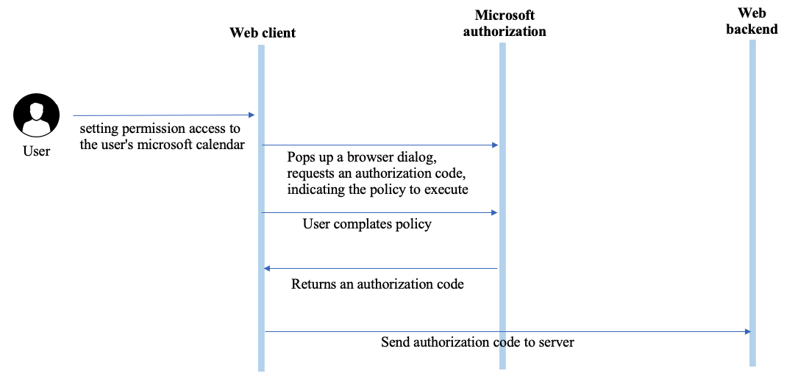
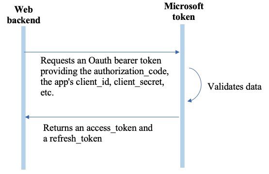
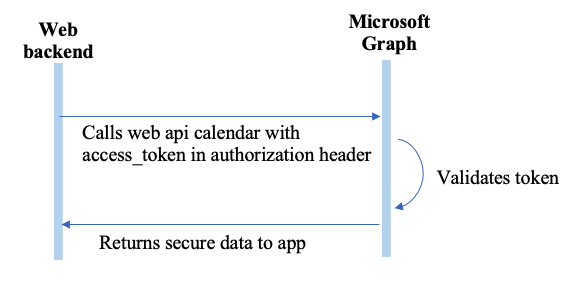
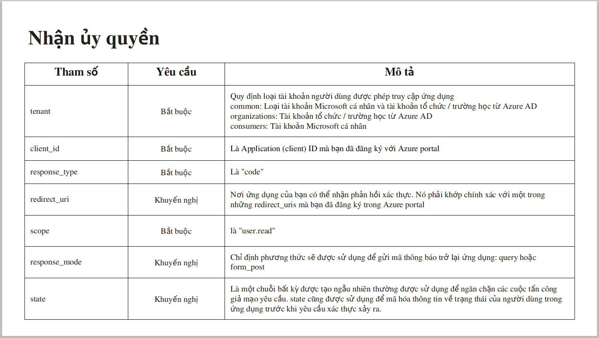

# Outlook calendars tutorials
Outlook calendar cho phép bạn quản lý email và danh bạ, tìm thông tin về người dùng trong tổ chức, sắp xếp thời gian cho công việc, gia đình và các hoạt động cá nhân.

## Cách thực hiện Authentication

*Bước 1. Nhận ủy quyền*


*Bước 2. Nhận Access token*


*Bước 3. Gọi Microsoft Graph bằng accessToken*


## Outlook calendars
#### **Đăng ký ứng dụng với Azure AD**
- > Truy cập [Azure portal](https://portal.azure.com/)
- >App registrations > New registration
- >Link redirect > save
- >Certificates & secrets > New client secret
- >API Permisstion > calendars.readwrite, calendars.read
#### **Thực hiện authentication**
 Sau khi tạo tài khoản Azure ta cần một số thông tin như sau : `AZURE_SECRET`, `AZURE_ID`, `AZURE_REDIRECT`, `AZURE_STATE`.

**Bước 1** : Client yêu cầu đăng nhập vs microsoft. Server thực hiện redirect đến máy chủ ủy quyền của microfsoft.
```
const urlRequestAuthor = `https://login.microsoftonline.com/common/oauth2/v2.0/authorize?
    client_id=${azureIdAzure}&
    response_type=code&
    redirect_uri=${AZURE_REDIRECT}&
    response_mode=query&
    scope=${scopeAzure}&
    state=${AZURE_STATE}`;
return res.status(301).redirect(urlRequestAuthor)
```
 Trong đó có 1 số options sau
 
- Sau đó client nhận lại được `CODE` nằm trong url. Có dạng :
`http://<domain>/<urlRedirect>?code=M.R3_BAY.b7705625-1585-a246-6c1b-4e4a04c424a1&state=QVpVUkUtUkFO...`

**Bước 2**: Client thực hiện POST Code cùng gửi lên server 2 để nhận code và xử lý.


```
// _Server 1 thuc hien POST "code" lên Server2_
  const code = req.query.code;
	console.log("Code :", code)
	const uri = "http://localhost:4000/code";
	const data = {
		code: code
	};
	const options1 = {
		method: 'POST',
		headers: { 'content-type': 'application/json' },
		data: JSON.stringify(data),
		url: uri,
	};
```
```
// _Server 2 nhận "code" để lấy Access token

  const code = req.body.code;
	const urlGetToken = "https://login.microsoftonline.com/common/oauth2/v2.0/token";
	let data = {
		client_id: AZURE_ID,
		scope: scopeAzure,
		code: code,
		redirect_uri: AZURE_REDIRECT,
		grant_type: "authorization_code",
		client_secret: AZURE_SECRET,
		response_mode: "form_post"
	};
	const options = {
		method: 'POST',
		headers: { 'content-type': 'application/x-www-form-urlencoded' },
		data: qs.stringify(data),
		url: urlGetToken,
	};
	const result = await axios(options);
	const accessTokenAzure = result.data.access_token;

```
#### Có được Access token ta thực hiện gọi đến Microsoft Graph bằng accessToken

1. **Get data Calendar_Groups, Calendars and Events**
    - method: `GET`
    - headers: `{ Authorization : Bearer ${accessTokenAzure} }`
    - URL:
    -  - Get all calendarGroups : _https://graph.microsoft.com/v1.0/me/calendarGroups_

    -  - Get all calendars : _https://graph.microsoft.com/v1.0/me/calendars_

    -  - Get all events : _https://graph.microsoft.com/v1.0/me/events_

    -  - Get all calendar by users :  _https://graph.microsoft.com/v1.0/users/outlook...@outlook.com/calendars_

    - - Get calendar by id: _https://graph.microsoft.com/v1.0/me/calendars/${idCalendar}_

    - - Get event by id: _https://graph.microsoft.com/v1.0/me/events/{idEvent}_

    - - Get events in calendarID: _https://graph.microsoft.com/v1.0/me/calendars/{idCalendar}/events_
  
    - - Get calendar account share: _https://graph.microsoft.com/v1.0/users/{userPrincipalNameAccount}/calendar_
    
    - - Get event by id : _https://graph.microsoft.com/v1.0/users/{userPrincipalName}/calendar/events/{idEvent}_
    - - Link [document](https://docs.microsoft.com/en-us/graph/api/resources/calendar?view=graph-rest-1.0) 

2. **ADD Events , Calendars and Calendar_Groups**
    - method: `POST`
    - headers: `{Content-Type :	application/json ,Authorization : Bearer ${accessTokenAzure} }`

**Add Event**
```
const data = {
    "subject": "Christmas dinner1111",
    "body": {
        "contentType": "HTML",
        "content": "Happy holidays!"
    },
    "start": {
        "dateTime": "2021-01-22T15:30:00",
        "timeZone": "Asia/Bangkok"
    },
    "end": {
        "dateTime": "2021-01-22T16:00:00",
        "timeZone": "Asia/Bangkok"
    },
    "location": {
        "displayName": "Harry's Bar"
    },
    "attendees": [
        {
            "emailAddress": {
                "address": "outlook_D814847BC8D772FA@outlook.com",  // nguoi nhan
                "name": "Nguyễn Đạt"
            },
            "type": "required"
        }
    ],
    "allowNewTimeProposals": true,
}
const options2 = {
    method: 'POST',
    headers: { 'content-type': 'application/json', 'Authorization': `Bearer ${accessTokenAzure}` },
    data: JSON.stringify(data),
    url: "https://graph.microsoft.com/v1.0/me/events",
};
```
- POST /me/calendar/events
- POST /me/calendars/{id}/events

**Add Calendar:**
```
const data = {
    "name": "Create calendar name"
}
const options2 = {
    method: 'POST',
    headers: { 'content-type': 'application/json', 'Authorization': `Bearer ${accessTokenAzure}` },
    data: JSON.stringify(data),
    url: "https://graph.microsoft.com/v1.0/me/calendars",
};
```
- POST /users/{id | userPrincipalName}/calendars
  
**Add Calendar Groups:**
```
const data = {
    "name": "Calendar Group name"
}
const options2 = {
    method: 'POST',
    headers: { 'content-type': 'application/json', 'Authorization': `Bearer ${accessTokenAzure}` },
    data: JSON.stringify(data),
    url: "https://graph.microsoft.com/v1.0/me/calendarGroups",
};
```
- POST /users/{id | userPrincipalName}/calendarGroups

3. **Edit Events , Calendars and Calendar_Groups**
    - method: `PATCH`
    - headers: `{ Authorization : Bearer ${accessTokenAzure} }`

**Edit Event**
```
const eventID = "AQMkADAwATM3ZmYAZS0wMm...";
const data = {
    "locations": [
        {
            "displayName": "New displayName "
        }
    ]
}
const options2 = {
    method: 'PATCH',
    headers: { 'content-type': 'application/json', 'Authorization': `Bearer ${accessTokenAzure}` },
    data: JSON.stringify(data),
    url: `https://graph.microsoft.com/v1.0/me/events/${eventID}`
```
- PATCH /me/groups/{id}/events/{id}
- PATCH /me/calendar/events/{id}
- PATCH /me/groups/{id}/calendar/events/{id}
- PATCH /me/calendars/{id}/events/{id}
- PATCH /me/calendargroup/calendars/{id}/events/{id}
- PATCH /me/calendargroups/{id}/calendars/{id}/events/{id}

**Edit Calendar**
```
const data = {
    "name": "Edit calendar name"
}
const options2 = {
    method: 'PATCH',
    headers: { 'content-type': 'application/json', 'Authorization': `Bearer ${accessTokenAzure}` },
    data: JSON.stringify(data),
    url: "https://graph.microsoft.com/v1.0/me/calendars/{id}"
};
```
- PATCH /me/calendarGroup/calendars/{id}
- PATCH /me/calendarGroups/{id}/calendars/{id}

**Edit Calendar Group**
```
const groupID = "AQMkADAwATM3ZmYAZS0wMmIx...";
const data = {
    "name": "Edit group"
}
const options2 = {
    method: 'PATCH',
    headers: { 'content-type': 'application/json', 'Authorization': `Bearer ${accessTokenAzure}` },
    data: JSON.stringify(data),
    url: `https://graph.microsoft.com/v1.0/me/calendarGroups/${groupID}`,
};
```
- PATCH /me/calendarGroups/{id}
- PATCH /users/{id | userPrincipalName}/calendarGroups/{id}


4. **Delete Events , Calendars and Calendar_Groups**
    - method: `DELETE`
    - headers: `{ Authorization : Bearer ${accessTokenAzure} }`

**Delete Events**
```
const eventID = "AQMkADAwATM3ZmYAZS0...";
const options2 = {
    method: 'DELETE',
    headers: { 'Authorization': `Bearer ${accessTokenAzure}` },
    data: JSON.stringify(data),
    url: "https://graph.microsoft.com/v1.0/me/events/${eventsID}",
};
```
- DELETE /me/events/{id}
- DELETE /groups/{id}/events/{id}
- DELETE /me/calendar/events/{id}
- DELETE /groups/{id}/calendar/events/{id}/
- DELETE /me/calendars/{id}/events/{id}
- DELETE /me/calendargroup/calendars/{id}/events/{id}
- DELETE /me/calendargroups/{id}/calendars/{id}/events/{id}

**Delete Calendar**
```
const calendarID = "AQMkADAwATM3ZmYAZS0w..."
const options2 = {
    method: 'DELETE',
    headers: { 'Authorization': `Bearer ${accessTokenAzure}` },
    data: JSON.stringify(data),
    url: "https://graph.microsoft.com/v1.0/me/calendars/${calendarID}"
};
```
- DELETE /me/calendars/{id}
- DELETE /me/calendarGroup/calendars/{id}

**Delete Calendar Group**
```
const groupID = "AQMkADAwATM3ZmYAZS0...";
const options2 = {
    method: 'DELETE',
    headers: { 'Authorization': `Bearer ${accessTokenAzure}` },
    data: JSON.stringify(data),
    url: `https://graph.microsoft.com/v1.0/me/calendarGroups/${groupID}`,
};
```
- DELETE /me/calendarGroups/{id}
- DELETE /users/{id | userPrincipalName}/calendarGroups/{id}


4. **Notification Calendars**

**List subscriptions**
- method: `GET`
- headers: `{ Authorization : Bearer ${accessTokenAzure} }`
- url : https://graph.microsoft.com/v1.0/subscriptions
  
```
const options = {
    method: 'GET',
    headers: { 'Authorization': `Bearer ${accessTokenAzure}` },
    url: `https://graph.microsoft.com/v1.0/subscriptions`
};
```
**Create subscriptions**
- method: `POST`
- headers: `{ Authorization : Bearer ${accessTokenAzure} }`
- url : https://graph.microsoft.com/v1.0/subscriptions

- **Create notificationUrl**

*a.* _Steps Configuring the Azure Event Hub_ :
1. _Open a browser to the Azure Portal._
2. _Select **Create a resource**._
3. _Type **Event Hubs** in the search bar._
4. _Select the **Event Hubs** suggestion. The Event Hubs creation 4. page will load._
5. _On the Event Hubs creation page, click **Create**._
6. _Fill in the Event Hubs namespace creation details, and then click **Create**._
7. _When the Event Hub namespace is provisioned, go to the page for the namespace._
8. _Click **Event Hubs** and + **Event Hub**._
9. _Give a name to the new Event Hub, and click **Create**._
10. _After the Event Hub has been created, click the name of the Event Hub, and then click **Shared access policies** and + Add to add a new policy._
11. _Give a name to the policy, check **Send**, and click **Create**._
12. _After the policy has been created, click the name of the policy to open the details panel, and then copy the **Connection string-primary key** value. Write it down; you'll need it for the next step._
    

*b.* _Steps Configuring the Azure Key Vault_ :
1. _Open a browser to the Azure Portal._
1. _Select **Create a resource**._
1. _Type **Key Vault** in the search bar._
1. _Select the **Key Vault** suggestion. The Key Vault creation page will load._
1. _On the Key Vault creation page, click **Create**._
1. _Fill in the Key Vault creation details, and then click **Review + Create** and **Create**._
1. _Go to the newly crated key vault using the **Go to resource** from the notification._
1. _Copy the **DNS name**, you will need it for the next step._
1. _Go to **Secrets** and click + **Generate/Import.**_
1. _Give a name to the secret, and keep the name for later; you will need it for the next step. For the value, paste in the connection string you generated at the Event Hubs step. Click **Create**._
1. _Click **Access Policies** and + **Add Access Policy**._
1. _For **Secret permissions**, select Get, and for **Select Principal**, select **Microsoft Graph Change Tracking**. Click **Add**._

*c.* _Steps Configuring the Azure Key Vault_ :
* **notificationUrl**: https://`<azurekeyvaultname>`.vault.azure.net/secrets/`<secretname>`?tenantId=`<domainname>`

  `azurekeyvaultname` - The name you gave to the key vault when you created it. Can be found in the DNS name.
  
  `secretname` - The name you gave to the secret when you created it. Can be found on the Azure Key Vault Secrets page.

  `domainname` - The name of your tenant; for example, consto.onmicrosoft.com or contoso.com.

**Code example**
```
const data = {
    "changeType": "created,updated,deleted",
    "notificationUrl": "https://keyvaultoutlookcalendar.vault.azure.net/secrets/nrx2?tenantId=xdatgdgmail.onmicrosoft.com",
    "resource": "/me/events",
    "expirationDateTime": "2022-09-19T20:00:00",
    "clientState": clientState
}
const options = {
    method: 'POST',
    headers: { "Content-Type": "application/json", 'Authorization': `Bearer ${accessTokenAzure}` },
    data: JSON.stringify(data),
    url: "https://graph.microsoft.com/beta/subscriptions",
};
```

**Get subscriptions**
- method: `GET`
- headers: `{ Authorization : Bearer ${accessTokenAzure} }`
- url : https://graph.microsoft.com/beta/subscriptions/{id}

```
const options = {
    method: 'GET',
    headers: { 'Authorization': `Bearer ${accessTokenAzure}` },
    url: `https://graph.microsoft.com/beta/subscriptions/{id}`
};
```

**Update subscriptions**
- method: `PATCH`
- headers: `{Content-type: application/json, Authorization : Bearer ${accessTokenAzure} }`
- url : https://graph.microsoft.com/beta/subscriptions/{id}

```
const data = {
   "expirationDateTime":"2023-11-22T18:23:45.9356913Z"
}
const options = {
    method: 'PATCH',
    headers: { Content-type: application/json, Authorization : Bearer ${accessTokenAzure} },
    data: JSON.stringify(data),
    url: `https://graph.microsoft.com/beta/subscriptions/{id}`
};
```

**Delete subscriptions**
- method: `DELETE`
- headers: `{ Authorization : Bearer ${accessTokenAzure} }`
- url : https://graph.microsoft.com/beta/subscriptions/{id}

```
const options = {
    method: 'DELETE',
    headers: { 'Authorization': `Bearer ${accessTokenAzure}` },
    url: `https://graph.microsoft.com/beta/subscriptions/{subscription-id}`
};
```
